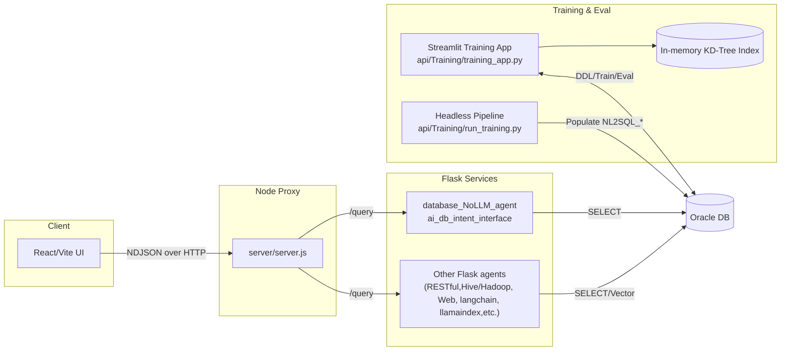

# InsightFlow Lite

Owner: Naveen Gupta 
Contact: g_naveen@hotmail.com
Free version. See Licence , September 2025

Rapidly builds AI agents, integrates enterprise databases, RESTful APIs, using NLP, evaluates against test prompts, and provides advanced data visualization (tables, pivots, charts, filters, virtualization, downloads). Also, intgerates seamlessly to local LLM models such as LLama, Phi, Gema, SQLCoder etc in a standard and generic fashion, just download the model, plug and play to the stack to use and evaluate.

Quick links:
- docs/ARCHITECTURE.md
- docs/TRAINING_PIPELINE.md
- docs/APIS.md
- docs/FRONTEND.md

Quick start:
- Backend training app (Streamlit): `streamlit run api/Training/training_app.py`
- Headless training pipeline: `python api/Training/run_training.py --host HOST --port 1521 --service SERVICE --user USER --password PASS --schema-owner OWNER`
- Node proxy server: `node server/server.js`
- Database Flask API: `python api/database_NoLLM_agent/ai_db_intent_interface.py`

## High‑level architecture:

###Upcoming Features

To transform NLP-to-SQL chat application into a world-class reporting and data exploration enterprise application, incorporate a robust set of features that cater to enterprise needs for usability, scalability, security, and advanced analytics. Below is a comprehensive list of upcoming features, grouped by category, that such an application should have to meet enterprise-grade standards. These features are designed to enhance functionality, user experience, and business value.

### 1. **Core NLP-to-SQL Functionality**
   - **Advanced Natural Language Understanding**: Enhance the NLP engine to handle complex queries, including multi-intent questions, synonyms, ambiguous terms, and context-aware query resolution (e.g., understanding "last quarter" or "top customers").
   - **Multi-Turn Conversations**: Support conversational context retention, allowing users to ask follow-up questions (e.g., "Show me sales data" followed by "Only for Europe").
   - **Query Validation and Suggestions**: Provide real-time feedback on query feasibility, suggest corrections for invalid queries, and offer query autocomplete or related question prompts.
   - **SQL Query Transparency**: Allow advanced users to view and edit the generated SQL queries for transparency and customization.
   - **Multi-Language Support**: Enable NLP to process queries in multiple languages to cater to global enterprises.
   - **Voice Input Integration**: Incorporate voice-to-text for hands-free query input, leveraging APIs like Google Speech-to-Text or Amazon Transcribe.

### 2. **Data Connectivity and Integration**
   - **Broad Database Compatibility**: Support connections to various databases (e.g., PostgreSQL, MySQL, Oracle, SQL Server, Snowflake, BigQuery, Redshift) and data lakes (e.g., Delta Lake, Apache Hadoop).
   - **API and Third-Party Integration**: Enable integration with enterprise systems like ERP (SAP, Oracle NetSuite), CRM (Salesforce, HubSpot), and other SaaS platforms via APIs.
   - **Real-Time Data Access**: Provide options for real-time data querying and batch processing for large datasets.
   - **Data Federation**: Allow querying across multiple data sources (e.g., combining data from a SQL database and a NoSQL store like MongoDB).
   - **ETL Pipeline Support**: Integrate with ETL tools (e.g., Apache Airflow, Talend) for data preprocessing and transformation before analysis.

### 3. **Reporting Capabilities**
   - **Dynamic Report Generation**: Enable users to generate custom reports via NLP queries (e.g., "Create a monthly sales report for 2025") with export options (PDF, Excel, CSV).
   - **Pre-Built Report Templates**: Offer industry-specific templates (e.g., financial, sales, HR analytics) for quick report creation.
   - **Scheduled Reports**: Allow users to schedule recurring reports (daily, weekly, monthly) with automated delivery via email or cloud storage (e.g., Google Drive, OneDrive).
   - **Interactive Dashboards**: Provide drag-and-drop dashboard builders with widgets for charts, tables, and KPIs, customizable via NLP or GUI.
   - **Drill-Down and Slice-and-Dice**: Enable users to explore data interactively by drilling into specific dimensions (e.g., region, product) or filtering dynamically.
   - **Ad-Hoc Reporting**: Support one-off, exploratory queries with immediate visualization outputs.

### 4. **Data Visualization**
   - **Rich Visualization Library**: Include a variety of chart types (bar, line, pie, scatter, heatmap, etc.) using libraries like Chart.js or D3.js, with support for 3D visualizations and geospatial maps.
   - **Customizable Visuals**: Allow users to customize chart colors, labels, and formats to match enterprise branding.
   - **Real-Time Dashboards**: Display live data updates in dashboards for monitoring KPIs (e.g., sales pipelines, inventory levels).
   - **Cross-Device Compatibility**: Ensure visualizations are responsive for desktop, tablet, and mobile devices.
   - **Annotations and Collaboration**: Enable users to add comments or annotations to charts and share dashboards with team members.

### 5. **Data Exploration and Analytics**
   - **Advanced Filtering and Segmentation**: Support complex filtering (e.g., "Show sales for customers aged 25-40 in Q3 2025") and dynamic segmentation of data.
   - **Predictive Analytics**: Integrate machine learning models for forecasting, trend analysis, and anomaly detection (e.g., "Predict sales for next quarter").
   - **What-If Analysis**: Allow users to simulate scenarios (e.g., "What if we increase marketing budget by 20%?") using hypothetical data inputs.
   - **Cohort Analysis**: Enable tracking of user-defined cohorts (e.g., customer retention by acquisition month).
   - **Statistical Summaries**: Provide quick insights like averages, medians, standard deviations, and correlations via NLP queries (e.g., "What’s the average order value by region?").
   - **Data Lineage and Audit Trails**: Track the origin and transformation of data used in reports for transparency and compliance.

### 6. **User Interface and Experience**
   - **Intuitive UI/UX**: Design a clean, modern interface with role-based dashboards (e.g., executive, analyst, manager) and customizable layouts.
   - **Embedded NLP Chat Interface**: Integrate a chatbot-like interface for NLP queries, with a conversational flow and guided query suggestions.
   - **Accessibility Features**: Ensure compliance with WCAG 2.1 standards (e.g., screen reader support, keyboard navigation).
   - **White-Labeling**: Allow enterprises to customize the UI with their branding (logos, colors, themes).
   - **Multi-Platform Support**: Offer web, iOS, and Android apps with consistent functionality, including offline capabilities for cached reports.

### 7. **Security and Governance**
   - **Role-Based Access Control (RBAC)**: Implement granular permissions to restrict data access based on user roles (e.g., department, seniority).
   - **Data Encryption**: Ensure data is encrypted in transit (TLS) and at rest (AES-256) to meet enterprise security standards.
   - **Single Sign-On (SSO)**: Support SSO integration with enterprise identity providers (e.g., Okta, Azure AD).
   - **Audit Logs**: Maintain detailed logs of user actions, queries, and data access for compliance (e.g., GDPR, HIPAA).
   - **Data Masking**: Automatically mask sensitive data (e.g., PII) based on user permissions.
   - **Compliance Certifications**: Ensure the application complies with standards like SOC 2, ISO 27001, and CCPA.

### 8. **Collaboration and Sharing**
   - **Team Collaboration**: Enable sharing of reports, dashboards, and queries via secure links, email, or integrated platforms (e.g., Slack, Microsoft Teams).
   - **Version Control**: Allow users to save and revert to previous versions of reports or dashboards.
   - **Commenting and Annotations**: Support in-app discussions on reports or specific data points for team collaboration.
   - **Export and Embedding**: Allow embedding of dashboards into other enterprise tools (e.g., intranet portals) and exporting in multiple formats.

### 9. **Scalability and Performance**
   - **High-Performance Query Engine**: Optimize the SQL engine for large datasets, using indexing, caching, and query optimization techniques.
   - **Cloud-Native Architecture**: Deploy on scalable cloud platforms (e.g., AWS, Azure, GCP) with support for containerization (Docker, Kubernetes).
   - **Load Balancing**: Handle high user concurrency with load balancing and distributed processing.
   - **Data Caching**: Implement in-memory caching (e.g., Redis) for frequently accessed queries to reduce latency.
   - **Horizontal Scaling**: Support scaling out to handle growing data volumes and user bases.

### 10. **Enterprise Administration**
   - **User Management**: Provide admin tools for managing users, roles, and permissions centrally.
   - **Usage Analytics**: Offer insights into application usage (e.g., most frequent queries, active users) for admins.
   - **Custom Workflows**: Allow admins to define custom workflows for report approval or data access.
   - **Monitoring and Alerts**: Enable real-time monitoring of system performance and alerts for anomalies or failures.
   - **API Access**: Provide a robust API for integrating the application with other enterprise systems (redirect to https://x.ai/api for xAI’s API details if relevant).

### 11. **AI-Powered Enhancements**
   - **Auto-Insights Generation**: Use AI to automatically highlight key trends, outliers, or correlations in the data (e.g., "Sales dropped 10% in Q2 due to reduced demand in Asia").
   - **Query Optimization Suggestions**: Recommend optimized ways to phrase queries for better performance or clarity.
   - **Personalized Recommendations**: Suggest relevant reports or visualizations based on user behavior and role.
   - **Anomaly Detection**: Automatically flag unusual data patterns and notify users (e.g., "Unusual spike in returns detected").
   - **Semantic Search**: Enable searching across reports, dashboards, and datasets using natural language.

### 12. **Support and Documentation**
   - **Comprehensive Help Center**: Provide in-app tutorials, FAQs, and documentation for users and admins.
   - **24/7 Support**: Offer enterprise-grade support with SLAs, including live chat, email, and phone support.
   - **Onboarding and Training**: Include guided onboarding for new users and training resources for advanced features.
   - **Community and Feedback**: Create a user community for sharing best practices and a feedback loop for feature requests.

### 13. **Customization and Extensibility**
   - **Custom Metrics and KPIs**: Allow users to define and save custom metrics (e.g., "Customer Lifetime Value") for reuse.
   - **Plugin Ecosystem**: Support third-party plugins or extensions for additional visualizations, data connectors, or analytics tools.
   - **Custom NLP Intents**: Enable enterprises to train the NLP engine on domain-specific terminology or jargon.
   - **White-Box AI**: Allow advanced users to fine-tune the NLP-to-SQL model with custom datasets or rules.

### 14. **Mobile and Offline Capabilities**
   - **Mobile App**: Offer full functionality on iOS and Android apps, including voice mode (similar to Grok’s voice mode on mobile apps).
   - **Offline Mode**: Allow access to cached reports and dashboards when offline, with sync capabilities when reconnected.
   - **Push Notifications**: Send alerts for scheduled reports, anomalies, or shared dashboards.

### 15. **Industry-Specific Features**
   - **Finance**: Support for financial modeling, balance sheets, and regulatory reporting (e.g., SEC filings).
   - **Healthcare**: Compliance with HIPAA, support for patient data analytics, and clinical trial reporting.
   - **Retail**: Inventory analysis, customer segmentation, and demand forecasting.
   - **Manufacturing**: Supply chain analytics, production KPIs, and IoT data integration.
   - **Marketing**: Campaign performance tracking, attribution modeling, and customer journey analysis.

### Implementation Considerations
- **Technology Stack**: Use scalable frameworks like React or Angular for the frontend, Node.js or Python (FastAPI/Flask) for the backend, and a robust NLP library (e.g., Hugging Face, spaCy) for query processing.
- **Testing and Validation**: Rigorously test the NLP-to-SQL translation for accuracy across edge cases and complex queries.
- **User Feedback Loop**: Continuously gather user feedback to refine NLP accuracy and UI/UX.
- **Performance Monitoring**: Use tools like Prometheus or Grafana to monitor application performance and query latency.

### Example Workflow
A user might interact with the application as follows:
1. Logs in via SSO and sees a role-based dashboard.
2. Types or speaks, “Show me sales by product category for Q3 2025 in Europe.”
3. The NLP engine translates this to SQL, queries the database, and displays a bar chart.
4. The user drills down to a specific category, exports the report as a PDF, and shares it via Slack.
5. The system suggests related queries like, “Compare Q3 2025 sales to Q2 2025.”

By incorporating these features, your NLP-to-SQL application can evolve into a comprehensive, enterprise-grade reporting and data exploration platform that competes with tools like Tableau, Power BI, or Looker, while leveraging the unique power of natural language interaction.

If you’d like me to generate a sample chart (e.g., to visualize sales data) or dive deeper into any specific feature (e.g., NLP enhancements or security protocols), let me know!
