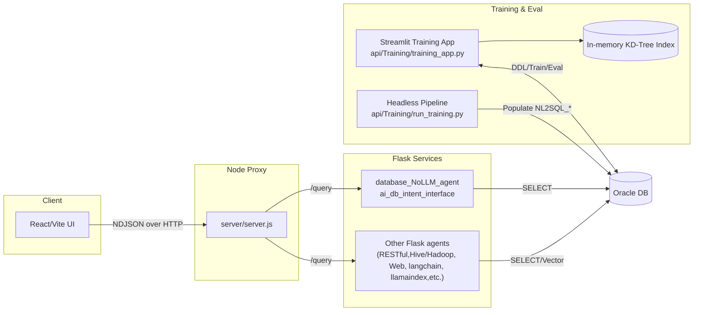

# InsightFlow Lite

Owner: Naveen Gupta 
Contact: g_naveen@hotmail.com
Free version. See Licence , September 2025

Rapidly builds AI agents, integrates enterprise databases, RESTful APIs, using NLP, evaluates against test prompts, and provides advanced data visualization (tables, pivots, charts, filters, virtualization, downloads). Also, intgerates seamlessly to local LLM models such as LLama, Phi, Gema, SQLCoder etc in a standard and generic fashion, just download the model, plug and play to the stack to use and evaluate.

Quick links:
- docs/ARCHITECTURE.md
- docs/TRAINING_PIPELINE.md
- docs/APIS.md
- docs/FRONTEND.md

Quick start:
- Backend training app (Streamlit): `streamlit run api/Training/training_app.py`
- Headless training pipeline: `python api/Training/run_training.py --host HOST --port 1521 --service SERVICE --user USER --password PASS --schema-owner OWNER`
- Node proxy server: `node server/server.js`
- Database Flask API: `python api/database_NoLLM_agent/ai_db_intent_interface.py`

## High‑level architecture:

