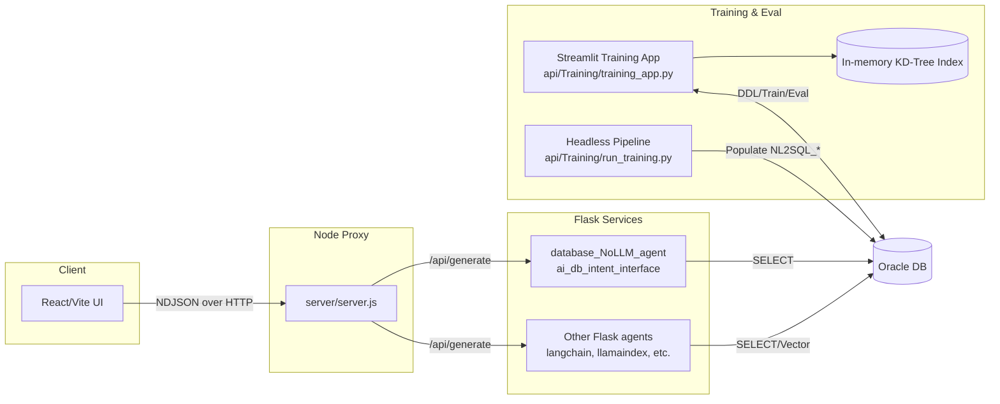
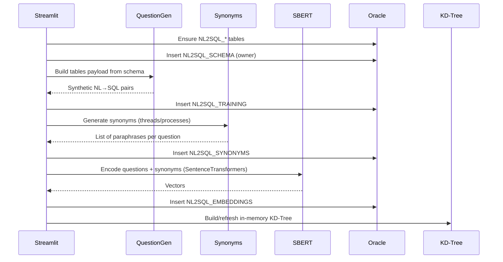

# Architecture Overview

This repository implements an end‑to‑end NL→SQL training and retrieval stack with a modern React UI, a Node proxy, multiple Flask microservices, and an Oracle‑backed training pipeline. The training surface is a Streamlit app that orchestrates schema ingestion, question synthesis, synonym/paraphrase generation, embedding, and evaluation.

## System Diagram

## Key Components

- `client/` (Vite + React): Rich table/chart UI, streaming NDJSON support, training manager link.
- `server/server.js` (Node): Single entry for UI to call; proxies to Flask services and streams responses.
- `api/database_NoLLM_agent/ai_db_intent_interface.py` (Flask): Intent→SQL lookup + Oracle execution; streams rows as NDJSON with safe serialization (CLOB/BLOB supported).
- `api/Training/training_app.py` (Streamlit): Human‑in‑the‑loop training/evaluation manager.
- `api/Training/run_training.py`: Headless pipeline (schema→questions→synonyms→embeddings→eval).
- `api/Training/utils/*`: Oracle helpers, KD‑Tree index, question and synonym generation.

## Data Model (Oracle)

- `NL2SQL_SCHEMA(schema_name, table_name, column_name, data_type, sql_type, qualified_table_name, qualified_column_name)`
- `NL2SQL_TRAINING(id, schema_name, table_name, question, sql_template)`
- `NL2SQL_SYNONYMS(id, training_id, question_syn)`
- `NL2SQL_EMBEDDINGS(id, training_id, question, embedding BLOB)`
- `NL2SQL_EVALUATION(id, prompt, expected_sql)`
- `NL2SQL_METRICS(run_id, prompt_id, is_hit, timestamp)`

## Data Flow

## Notes & Trade‑offs

- KD‑Tree uses Euclidean distance; app reports a derived similarity value. Consider pre‑normalizing vectors and using cosine distance for interpretability.
- Synonyms blend WordNet, custom maps, and SBERT‑based paraphrases; optional semantic filtering prunes outliers.
- The intent Flask has a static intent→SQL map; it’s intended as a thin direct‑SQL baseline, not a learned model.

